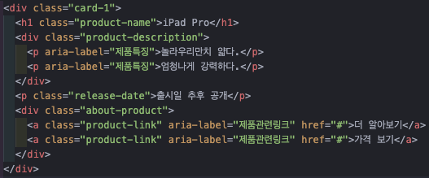
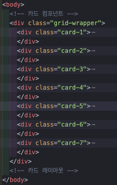
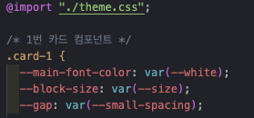
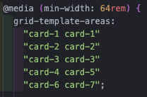
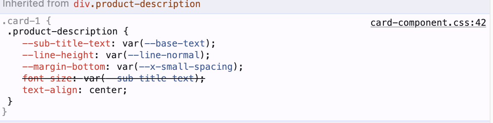

# apple 마크업 과제

---

> # 목차
>
> 1. [마크업](#마크업)
> 2. [스타일링](#스타일링)
> 3. [구현결과](#구현결과)
> 4. [과제 회고](#과제회고)
> 5. [링크](#링크)

---

> ## 마크업

1. `Card Component` 구성은 아래와 같이 진행하였음.  
   
2. 총 7개의 `Card Component` 배치를 위해 각 컴포넌트를 감싸는 `grid-wrapper`를 선언하였음.  
   

---

> ## 스타일링

1. `Custom Properties`사용을 위해 `theme.css`파일을 `import`해 진행하였음  
   
2. `Card Component`는 `flex`속성을 사용하여 작성 후 전체적인 레이아웃은 `grid`속성을 사용하였음.
3. 미디어 쿼리를 사용하여 `1024px`의 `breakpoint`를 설정하였음.
4. 가로 길이가 `1024px`이 되는 순간 아래 4개의 컴포넌트는 두 줄로 변경되게끔 구성하기 위해 `grid`속성 중
   `grid-template-area`속성을 사용하였음.  
   
5. ``태그를 사용하지 않고 `
`태그에 `background`속성을 통해 이미지를 넣었으며, 픽셀 밀도 차이에 따라 각각 다른 이미지 소스를 제공하기 위해 `background: image-set`속성을 사용하였음.

---

> ## 구현결과
>
> 

> ## 과제회고
>
> > ### 기술적 이슈
> >
> > - 부제목을 마크업 하기에 `h2`요소가 적당할 것 같아 사용했었는데 agent style에 user style이 먹혀 `font-size`가 조정이 되지 않는 이슈가 있었음.
> >   - 이슈의 원인을 찾지 못 해 `
`요소로 진행하여 마크업했음.
> >     
> >
> > ### 느낀점
> >
> > **1. HTML, CSS 파트의 과제들을 수행하면서 스스로가 반응형 레이아웃이 가장 취약하다는 것을 느꼈음.**  
> > **2. 접근성 향상을 위해 적절한 WAI-ARIA 사용에 대한 이해도가 보다 높아져야 할 필요성을 느낌**
> >
> > > 지속적으로 레이아웃을 구성해보는 것도 좋지만 스스로 느끼기에 만들어진 레이아웃 코드를 보면서 해당 속성의 역할이 여기서 무엇을 위해 작동할지를 분석하는 실력을 기를 필요성을 느낌.
> >
> > ### 의문점
> >
> > 1. `
`태그 안에 직접적으로 ``요소를 선언하지 않고 배경화면으로 이미지를 제공할 경우, `role="img"`속성을 부여하는 것이 맞는지 의문이 생김.

---

> ## 링크
>
> [과제 구현 페이지 링크](https://llhyeon.github.io/homework/apple/apple.html)
