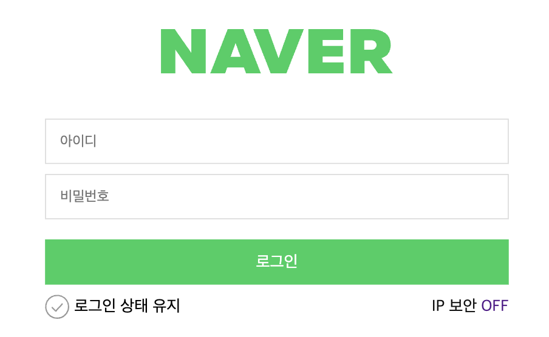
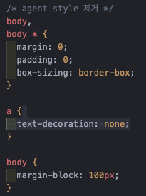
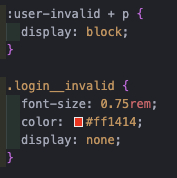
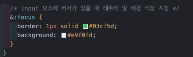
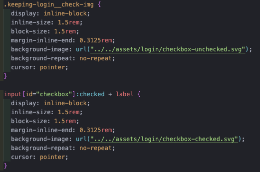
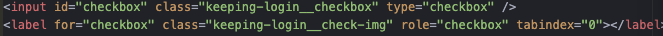

# Naver Login 폼 마크업 과제

---

> ## 목차

1. [마크업 진행](#마크업-진행)
2. [스타일링 진행](#스타일링-진행)
3. [접근성 향상](#접근성-향상)
4. [과제 회고](#과제-회고)
5. [과제 링크](#과제-링크)

---

> ## 마크업 진행

1.  Naver Login 요소의 로고 페이지를 메인 키워드로 생각하여 `<h1>`태그를 사용 후 그 안에 네이버 홈으로 연결되는
    `<a>`태그를 사용 후 `<figcation>`요소에 `class="sr-only"` 속성을 더해 이미지 대체 텍스트로 사용하였습니다.  
    

2.  `<input>`태그를 사용하여 ID, PW 입력창을 만들고 `<label>` 태그를 묶은 후 `class="sr-only"`속성을 추가했습니다.
3.  각각의 `<input>`태그 밑에 `
`태그를 사용하여 `<input>`요소 값이 유효하지 않을 때의 메세지를 나타내기 위해 `
`태그를 사용하여 메세지를 기입 후 `display: none` 처리를 했습니다.
4.  로그인 버튼에는 `tabindex: 1`속성을 추가하여 키보드로 접근 시 '로그인 상태 유지' 체크 표시 이후에 포커스가 가도록 설정했습니다.
5.  로그인 상태 유지 이미지 스타일 변경을 위해 `label`태그를 `input`태그와 연결 후 배경 속성으로 체크 이미지를 넣었습니다.
6.  `input`요소에 `:checked` 가상 요소를 사용해 체크가 됐을 시 이미지가 변경되게 설정했습니다.
7.  마지막으로 `div, span, a`요소를 사용해 IP 보안 온오프 링크를 만들었습니다.

---

> ## 스타일링 진행

1.  reset 파일을 사용하지 않고 최소한의 agent style을 제거하였습니다.  
    
2.  `:root`가상 선택자를 활용해 기본 스타일을 custom properies로 사용하였습니다.
3.  `div class="naver"`요소를 전체를 감싸는 wrapper로 설정 후 `display:flex` 속성을 추가하여 가로 정렬 후
    `gap` 속성을 통해 각 하위 요소별 간격 설정을 하였습니다.
4.  `form`요소에 `:user-invalid` 가상 선택자를 사용하여 `input`요소의 값이 유효하지 않을 때 `display: none` 처리를 해두었던 에러 메세지가 보이게 스타일링 하였습니다.  
    
5.  미디어 쿼리를 사용하여 가로 길이기 768px 이상 시에 `form`요소의 가로 길이는 500px로 고정이 되게끔 설정하였습니다.
6.  하위 요소 중 `input`요소에 nesting으로 `:focus`가상 선택자를 선택해 ID와 PW 입력창에 커서가 활성화 됐을 시 스타일을 변경하였습니다.  
    
7.  로그인 버튼은 `button`태그를 사용하였는데 기본적인 agent style 제거를 위해 `all: unset`속성을 부여하였습니다.
8.  로그인 버튼 밑에 있는 '로그인 상태유지' 체크표시의 변경은 `:checked`가상 선택자를 활용해 인접한 `label`요소의 배경이미지가 check 활성화 시 변경되도록 설정하였습니다.  
    
9.  미디어 쿼리를 사용하여 가로 사이즈가 768px 미만일 경우 '로그인 상태 유지' 표시만 우측에 오도록 설정하였고, 768px 이상 시
    '로그인 상태 유지' 표시가 좌측으로 이동하고, 'IP 보안' 온오프 링크가 우측에 나타나도록 설정하였습니다.

---

> ## 접근성 향상

1. 로그인 창 최상단에 있는 로고에 `aria-label` 속성을 사용해 네이버 홈으로 이동하는 링크임을 명시하였습니다.
2. 로고이미지로 사용한 이미지 포맷이 `svg` 포맷이기에 해당 이미지 요소에 `role="img"`속성을 주었습니다. 이후 대체텍스트를 공란으로 두는 대신 `figcaption`요소를 통해 이미지를 설명하고 스크린 리더에서만 읽히게끔 설정하였습니다.
3. 키보드로 접근했을 시를 고려하여 로그인 상태유지 체크 박스와 로그인 버튼에 각각 `tabindex=0, tabindex=1`속성을 부여하여 로그인 버튼을 누르기 전에 로그인 유지상태를 체크할 수 있게 설정하였습니다.
4. IP 보안 요소에 `aria-label`속성을 활용하여 보조설명을 기입하였습니다.

---

> ## 과제 회고

1. 이미지 크기에 따라 변동되는 UI를 만들 때 생각보다 `flex-grow, flex-shrink` 옵션보다 가로, 세로의 크기를 `%`로 설정하는 방법을 많이 사용했던 것 같다.
   - `flex` 속성에 대한 지속적인 심화공부와 실습의 필요성을 느낌
2. `label`요소의 배경으로 체크박스 이미지를 설정하고 `input`요소의 `:checked`가상 선택자를 활용하여 배경이미지의 URL을 변경하는 과정에서 체크 표시는 되는데 이미지가 변경되지 않는 이슈가 있었음.
   - **원인** : `label`요소가 `input`요소보다 앞에 있었음. 평소에 `input`요소를 사용하기 전에 늘 `label`요소를 먼저 선언하는 습관때문에 벌어진 이슈였음.
   - **해결** : 사진처럼 `input`요소 이후에 `레이블`요소를 선언하여 해결하였음.  
     
3. IP 보안 링크를 클릭하였을 때 'OFF'가 'ON'으로 변경되게끔 설정하고 싶었으나 실패하였음
   - 시도 : `:acitve` 가상 선택자를 통해 링크가 활성화 됐을 시 `::after` 요소의 `content`속성의 값을 'ON' 텍스트를 주고 기존의 `a`태그는 보이지 않게 `diplay: none`속성을 넣었지만 아예 링크 자체가 열리지 않는 이슈가 있었음.  
     본 이슈에 대해 아직 해결하지 못 함.

---

> ## 과제 링크
>
> > [Login.html 파일 링크](../login/login.html)  
> > [Github 페이지 배포 링크](https://llhyeon.github.io/homework/)  
> > [Login Form 페이지 링크](https://llhyeon.github.io/homework/login/login.html)
